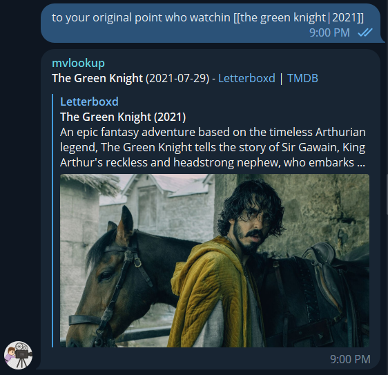

# mvlookup

A Telegram bot that helps facilitate conversations about films by servicing inline queries for film data.

You can try it out by messaging [@mvlookup_bot](https://t.me/mvlookup_bot) on Telegram.




## Using the bot
The bot responds to inline queries in the form:

```
[[title|optional(year)]]
```

For each instance of this pattern in a message, the bot will respond with the title and 
release date of the film, if found, plus links to the film on 
[Letterboxd.com](https://letterboxd.com/) and [TMDB](https://www.themoviedb.org/). 
The bot will indicate if no films match the query.

## Running the bot

#### Requirements
- Java 17
- Optionally Apache Maven, else the bundled `./mvnw` may be used

This application runs on [Quarkus](https://quarkus.io/) and can be run in Quarkus' dev mode by running:
```shell
mvn quarkus:dev
```

To build an über-jar, run:
```shell
mvn clean package
```
The runnable `.jar` will then be available at `target/mvlookup-{VERSION}-runner.jar`.

#### Environment variables
| Variable name               | Variable type | Required? | Description                                                                                             |
|-----------------------------|---------------|-----------|---------------------------------------------------------------------------------------------------------|
| `MVLOOKUP_BOT_TOKEN`        | String        | Yes       | The bot token to use to authenticate to the Telegram API.                                               |
| `MVLOOKUP_BOT_URL`          | URL           | Yes       | The bot URL to use when receiving updates via webhooks. Must be set even if webhooks are disabled.      |
| `MVLOOKUP_SHARED_SECRET`    | String        | No        | A value for Telegram to include in the `X-Telegram-Bot-Api-Secret-Token` header when using webhooks.    |
| `MVLOOKUP_ENABLE_WEBHOOKS`  | Boolean       | No        | Default `false`. Whether to receive Telegram updates via webhooks.                                      |
| `MVLOOKUP_TELEGRAM_API_URL` | URL           | No        | An alternative URL for Telegram, useful e.g. if you're running your own API server.                     |
| `TMDB_API_URL`              | URL           | No        | The URL to use when calling TMDB.                                                                       |
| `TMDB_API_TOKEN`            | String        | Yes       | Your API token for authenticating to TMDB.                                                              |
